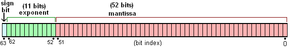

#number 
包含: Byte,Short,Integer,Long,Float,Double 包装类

##byte
###基本实现
1. 占用1个字节,表示范围：-128-127, -2<<7 到 2<<7-1;
2. 内部类：ByteCache, 实际上是一个数组,用来存储byte表示范围中的256个数字
3. 构造方法：public Byte(byte value) , public Byte(String s);没有无参构造方法

###常用方法
1. public static String toString(byte b) 将byte转String
2. public static Byte valueOf(byte b) byte装箱
3. public static byte parseByte(String s, int radix) 字符串转byte,radix为进制,转换后超范围会抛异常
4. public static byte parseByte(String s) throws NumberFormatException  字符串按10进制转byte
5. public static Byte valueOf(String s, int radix) 转Byte对象
6. public static Byte valueOf(String s) throws NumberFormatException 按10进制转Byte
7. public static Byte decode(String nm) throws NumberFormatException 破译成Byte。参数decimal, hexadecimal, and octal numbers
8. public byte byteValue() 获取基本数据类型byte
9. public short shortValue()
10. public int intValue()
11. public long longValue()
12. public float floatValue()
13. public double doubleValue()
14. public String toString()
15. public int hashCode() 返回实际值
16. public boolean equals(Object obj) 比较实际值
17. public int compareTo(Byte anotherByte) 比较大小
18. public static int compare(byte x, byte y)
19. public static int toUnsignedInt(byte x) 转成int return ((int) x) & 0xff
20. public static long toUnsignedLong(byte x) 转成long return ((long) x) & 0xffL

##Short
###基本实现
1. 占用两个字节 表示范围 -32768-32767 -2<<15 到 2<<15-1
2. public Short(short value) public Short(String s)
3. 内部类 ShortCache 缓存byte表示范围的256个数字
###常用方法
同Byte类
##Integer
###基本实现
1. 占用4个字节 表示范围 -2<<31 到 2>>31-1

###常见方法 与short类同的方法忽略
1. public static int parseInt(String s, int radix) throws NumberFormatException 字符串转int，可选不同进制
2. public static Integer valueOf(String s) throws NumberFormatException 字符转Integer，10进制
3. public static int hashCode(int value)
4. public static Integer getInteger(String nm, Integer val) 获取系统变量 1:property name,2:default value
5. public static int highestOneBit(int i) 二进制最左侧的1代表的数值
6. public static int lowestOneBit(int i) 二进制最右侧的1代表的数值
7. public static int numberOfLeadingZeros(int i) 左侧填充的0的个数
8. public static int bitCount(int i) 二进制1的个数
9. public static int rotateLeft(int i, int distance) 二进制位向左翻转 如 (1011,2) = 101100
10. public static int rotateRight(int i, int distance) 二进制位向右翻转，超过最后侧位数，会到符号位
11. public static int reverse(int i) 二进制32位,全部翻转

##Long 与 Integer 基本一致

##Double
###基本实现
1. double 占用8个字节共64位,第2位是符号位;第62-52位 是e的个数位;0-51位表示精度位。所以double最大精度为16位，当数字小于
    2的51次方时,可显示17位，但不能保证第17位的精度
 
    ```java
    //表示范围
    public static final double MAX_VALUE = 0x1.fffffffffffffP+1023; // 1.7976931348623157e+308
    public static final double MIN_NORMAL = 0x1.0p-1022; // 2.2250738585072014E-308
    public static final double MIN_VALUE = 0x0.0000000000001P-1022; // 4.9e-324

    ```

2. 构造方法
public Double(String s)
public Double(double value)

###常用方法
1. public boolean isNaN() 判断当前对象是不是NaN;
   > 定义：　　
   > -  　　NaN（Not a Number，非数）是计算机科学中数值数据类型的一个值，表示未定义或不可表示的值。常在浮点数运算中使用。首次引入NaN的是1985年的IEEE 754浮点数标准。
   > -  会返回NaN的运算：
   > -  操作数中至少有一个是 NaN 的运算
   > -  未定义操作
   > - 下列除法运算：0/0、∞/∞、∞/−∞、−∞/∞、−∞/−∞
   > - 下列乘法运算：0×∞、0×-∞
   > - 下列加法运算：∞ + (−∞)、(−∞) + ∞
   > - 下列减法运算：∞ - ∞、(−∞) - (−∞)
   > - 产生复数结果的实数运算。例如：
   > - 对负数进行开方运算
   > - 对负数进行对数运算
   > - 对比-1小或比+1大的数进行反正弦或反余弦运算

2. public boolean isInfinite() 判断是否无穷数
3. public static int hashCode(double value) 获取一个double数值的hashcode,实际取决于虚拟机生成的值
```java
    public static int hashCode(double value) {
            long bits = doubleToLongBits(value);
            return (int)(bits ^ (bits >>> 32));
        }
        
    public static long doubleToLongBits(double value) {
            long result = doubleToRawLongBits(value);
            // Check for NaN based on values of bit fields, maximum
            // exponent and nonzero significand.
            if ( ((result & DoubleConsts.EXP_BIT_MASK) ==
                  DoubleConsts.EXP_BIT_MASK) &&
                 (result & DoubleConsts.SIGNIF_BIT_MASK) != 0L)
                result = 0x7ff8000000000000L;
            return result;
        }
```

##BigInteger
###基本实现
1. signum 表示符号，实际值存储在int[]。数组长度最长为(1 << 26)
2. public BigInteger(byte[] val) 例：{1，2} = 1*256+2
   public BigInteger(String val)
   

##BigDecimal
###基本实现
1. 基于BigInteger实现，scale表示小数点后有多少位，stringCache 是数字的string，如果值在long类型的表示范围内，把值存到intCompact中
```java
    private final BigInteger intVal;
    private final int scale; 
    private transient int precision;
    private transient String stringCache;
    private final transient long intCompact;
```
2. 构造方法
 - public BigDecimal(BigInteger val)
 - public BigDecimal(BigInteger unscaledVal, int scale, MathContext mc) 
```java
class MathContext{   
    final int precision; 
    final RoundingMode roundingMode;
} //precision 有效位数 roundingMode 截取方式 默认 四舍五入
```
 - public BigDecimal(String val) 参数可以是int,long,double,String 由于精度问题,不建议使用double传参

###常见方法
1. 
